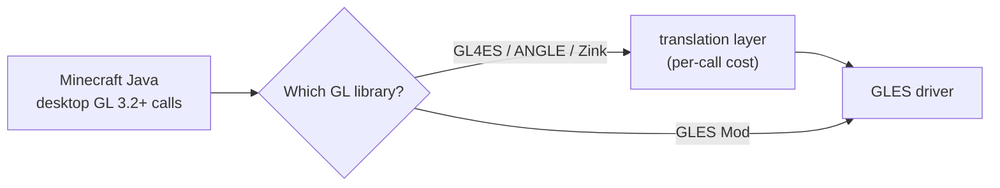
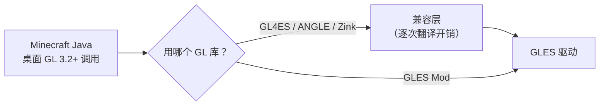

<div align="center">

# GLES Mod

**A native OpenGL ES 3.2 rendering backend for Minecraft Java Edition on Android.**

Play Minecraft Java on Android through *real* OpenGL ES 3.2 — not through a
translation layer.

[](LICENSE)
[](#requirements)
[](#requirements)
[](#requirements)

[English](#english) · [中文](#中文)

</div>

---

<a name="english"></a>

## English

### What is this?

`GLES Mod` lets **Minecraft: Java Edition 1.21.1** run on Android against the
device's **native OpenGL ES 3.2** driver.

On Android, Minecraft Java normally runs through a translation layer: the game
issues desktop OpenGL 3.2+ calls, and a shim (GL4ES, ANGLE, Zink, …) translates
every one of them into GLES. That works, but the per-call cost is paid on the
hottest paths in the frame — tens of thousands of `glUniform*` /
`glBindTexture` / `glVertexAttribPointer` calls per frame.

This project takes a different route: it ships a **GL library that *is* the
implementation**. Launchers such as FCL `dlopen` a GL library and hand it to
LWJGL; instead of pointing at a translation layer, you point at ours.



### Features

| | |
|---|---|
| **Native ES 3.2 backend** | 849 exported GL symbols — 345 forwarded, 20 custom implementations, 484 safe stubs. No per-call JNI. |
| **GLSL → GLSL ES converter** | Desktop GLSL is not GLSL ES. The biggest difference: **desktop GLSL silently converts `int` → `float`, GLSL ES refuses to**. This converter rewrites the source at load time so shaders that work on desktop keep working on ES. It is the single most important component in this project. |
| **Capability probing & graceful degradation** | Probes what the device actually supports, reports it, and degrades rather than crashing. Missing a feature is a decision, not an accident. |
| **Sodium / Embeddium aware** | Detects the optimisation mod and its version, and picks a known-good strategy. Unknown versions take a *conservative* path and say so. Never guesses at internals, never mixin-injects into them. |
| **Shaderpack capable** | Works with Iris + Veil + Flywheel pipelines. Shaders needing features ES lacks (compute, SSBO, tessellation) are skipped explicitly with a logged reason. |
| **Shared native core** | One C core (`libgl_gles.so`) serves both delivery forms — a NeoForge mod and an FCL renderer plugin. |

### Requirements

| | |
|---|---|
| Minecraft | **1.21.1** |
| Mod loader | **NeoForge 21.1.241** |
| Java | **21** |
| Android | **arm64-v8a** or **armeabi-v7a**, with **OpenGL ES 3.2** |
| Launcher | **FCL** (Fold Craft Launcher) for the renderer plugin; the NeoForge mod works in any launcher that can load a GL library |

> Verified device: Xiaomi houji / SM8650 / **Adreno 750** / Android 16 / GLES 3.2.

### Installation

Two pieces, deliberately separated:

**1. The NeoForge mod** — `glesmod-1.0.0.jar`

Drop it into `mods/`. This is the cross-launcher form: it handles capability
reporting, mod compatibility detection, and status output. It is **advisory
only** — on its own it cannot replace the GL library.

**2. The FCL renderer plugin** — `glesmod-renderer-plugin.apk`

Install it as an FCL renderer plugin, then select it in FCL's
**Renderer** settings. This is where the actual GL implementation lives.
FCL `dlopen`s the GL library by path — no `LD_PRELOAD`, no inline hooking, no
launcher modification. That is why this project is a renderer plugin by
construction.

> The native library is **not** inside the mod jar. It lives in the plugin APK.
> If you only install the jar, nothing changes — and that is the most common
> "I installed it and nothing happened".

### Building

```bash
./gradlew build                                # NeoForge mod jar
```

Native library and plugin APK need the Android NDK:

```powershell
./build-all.ps1 -WithPlugin                    # everything: jar + .so + apk
./build-all.ps1                                # jar + .so only
```

> ⚠️ `-WithPlugin` is **not** implied. Without it the APK is *not rebuilt*, so
> the device keeps loading the previous native library even though the code
> changed. There is a gate for this (`native/tools/check_artifact_freshness.py`)
> because it has already cost one full device test round.

Toolchain: **JDK 21**, **Android SDK** (`aapt2`/`d8`/`zipalign`/`apksigner`),
**Android NDK 27.x** (Clang, CMake, Ninja, `glslc`). See
[`docs/build-environment.md`](docs/build-environment.md).

### Testing

The converter is the risky part, so it is tested the hardest — entirely on the
host, in seconds, with no device needed:

```bash
py -X utf8 native/tools/run_all_gates.py
```

| Gate | What it proves |
|---|---|
| `roundtrip` | Convert test shaders, validate output with the real GLSL ES front end (`glslc` from the NDK) |
| `veil pinwheel` | Veil's 48 shaders convert and compile |
| `mc core` | All 125 Minecraft core shaders convert and compile |
| `bsl pack` | 182 shaders from a real shaderpack |
| `flywheel dumps` | Flywheel's assembled device shaders re-convert cleanly |
| `sable splice` | Sable's Flywheel overrides spliced into a real dump, then converted |
| `gitignore` | Third-party material can never reach git history |
| `device fixtures` | Shaders that **actually failed on a phone** now compile |
| `builtin int args` | Built-in functions whose parameters are `int` are not float-ised |
| `artifact freshness` | The shipped binaries actually contain the current fixes |

Attribution matters as much as the result: every fix is verified by an **A/B
control build** (`-DGLESMOD_NO_RULE_*`) so we know the change caused the
improvement, and every converter rule has a **required-string marker** so a
stale binary can never masquerade as a fixed one.

### Compatibility

| Optimisation mod | Version | Status |
|---|---|---|
| Sodium | `0.8.13+mc1.21.1` | ✅ Fully supported (device-verified) |
| Embeddium | `1.0.15+mc1.21.1` | ✅ Device-verified, no visual issues |
| Sodium / Embeddium | other versions | ⚠️ Conservative path, and told so in the log |
| *(none)* | — | ✅ Vanilla path |

Also runs alongside **Iris**, **Veil**, **Flywheel**, **Sable**,
**Create + Aeronautics** and friends. See
[`docs/p2-07-compatibility-matrix.md`](docs/p2-07-compatibility-matrix.md).

### Known limitations

Stated plainly, because pretending otherwise helps nobody:

- **No compute / SSBO / tessellation.** GLES 3.2 does not have them. Shaders
  that need them are skipped with a logged reason — not silently broken.
- **Multi-Draw is unavailable**, so Sodium chunk rendering falls back to
  per-draw submission: a small performance cost.
- **Not every possible shader compiles.** The converter covers the constructs
  we have met and can prove; when it cannot convert, it forwards the original
  source *and* dumps both versions to `glesmod/native.log` so the failure is
  diagnosable rather than mysterious.
- **No EGL takeover.** We provide GL only and reuse the launcher's existing
  context, deliberately avoiding a second translation stack on top of ANGLE.

### Documentation

| Document | Contents |
|---|---|
| [`开发任务书.txt`](开发任务书.txt) | Requirements & decision log (Chinese) |
| [`docs/architecture.md`](docs/architecture.md) | Architecture and design rationale |
| [`docs/capability-interface.md`](docs/capability-interface.md) | Native ↔ Java capability interface |
| [`docs/test-guide.md`](docs/test-guide.md) | How to reproduce the test suite |
| [`docs/p2-07-compatibility-matrix.md`](docs/p2-07-compatibility-matrix.md) | Compatibility matrix |
| [`docs/status-report.md`](docs/status-report.md) | Phase status report |

### License

**LGPL-3.0-or-later** — see [`LICENSE`](LICENSE).

LGPL rather than MIT, deliberately: this project's role is to **replace a
system library**, so it should remain replaceable. If you ship a modified
`libgl_gles.so`, the changes need to come back.

Third-party components, build-time dependencies, and material that is
deliberately kept out of the repository are listed in
[`THIRD-PARTY-NOTICES.md`](THIRD-PARTY-NOTICES.md).

**Minecraft** is a trademark of Mojang Studios / Microsoft. This is an
unofficial third-party project, not affiliated with or endorsed by Mojang
Studios or Microsoft. This project contains no Minecraft game code or assets.

---

<a name="中文"></a>

## 中文

### 这是什么？

`GLES Mod` 让 **Minecraft: Java 版 1.21.1** 在 Android 上直接跑在设备的
**原生 OpenGL ES 3.2** 驱动之上。

Android 上的 Minecraft Java 通常要穿过一层翻译：游戏发出桌面 OpenGL 3.2+ 调用，
由 GL4ES / ANGLE / Zink 之类的兼容层逐条翻译成 GLES。这能跑，但代价落在每一帧
最热的路径上 —— 每帧数万次 `glUniform*` / `glBindTexture` /
`glVertexAttribPointer`，每次都要过一次翻译。

本项目走另一条路：**提供一个「本身就是 GL 实现」的 GL 库**。
FCL 等启动器通过 `dlopen` 加载一个 GL 库并交给 LWJGL —— 不要指向兼容层，
而是指向我们。



### 特性

| | |
|---|---|
| **原生 ES 3.2 后端** | 导出 849 个 GL 符号 —— 345 个转发、20 个定制实现、484 个安全桩。热点路径不经过 JNI。 |
| **GLSL → GLSL ES 转换器** | 桌面 GLSL 不是 GLSL ES。最大的差异是：**桌面 GLSL 允许 `int` → `float` 隐式转换，GLSL ES 不允许**。本转换器在着色器加载时改写源码，让桌面能跑的着色器在 ES 上也能跑。这是本项目最关键的部件。 |
| **能力探测与优雅降级** | 探测设备真实能力并如实上报；能力不足时降级而不是崩溃。缺功能是一个**经过判断的决定**，不是意外。 |
| **感知 Sodium / Embeddium** | 识别优化模组及其版本，选择已验证的策略。未知版本走**保守**路径并在日志中说明。绝不猜测其内部实现，也不对其做 Mixin 注入。 |
| **支持光影包** | 与 Iris + Veil + Flywheel 管线共存。需要 ES 不具备的能力（compute、SSBO、曲面细分）的着色器会被**显式跳过并记录原因**。 |
| **原生核心共享** | 一份 C 核心（`libgl_gles.so`）同时服务两种交付形态 —— NeoForge 模组与 FCL 渲染器插件。 |

### 环境要求

| | |
|---|---|
| Minecraft | **1.21.1** |
| 模组加载器 | **NeoForge 21.1.241** |
| Java | **21** |
| Android | **arm64-v8a** 或 **armeabi-v7a**，且支持 **OpenGL ES 3.2** |
| 启动器 | 渲染器插件需要 **FCL（Fold Craft Launcher）**；NeoForge 模组可用于任何能加载 GL 库的启动器 |

> 已验证设备：Xiaomi houji / SM8650 / **Adreno 750** / Android 16 / GLES 3.2。

### 安装

两件东西，刻意分开：

**1. NeoForge 模组** —— `glesmod-1.0.0.jar`

放进 `mods/`。这是跨启动器的形态：负责能力上报、优化模组兼容检测、状态输出。
它**只做辅助** —— 单独装它无法替换 GL 库。

**2. FCL 渲染器插件** —— `glesmod-renderer-plugin.apk`

作为 FCL 渲染器插件安装，然后在 FCL 的 **Renderer** 设置里选中它。
真正的 GL 实现在这里。FCL 是按路径 `dlopen` GL 库的 —— 不需要 `LD_PRELOAD`、
不需要 inline hook、不需要改启动器。这也是本项目**天然就是**一个渲染器插件的原因。

> 原生库**不在**模组 jar 里，而在插件 APK 里。
> 只装 jar 不会有任何变化 —— 这是最常见的「我装了但没反应」。

### 构建

```bash
./gradlew build                                # NeoForge 模组 jar
```

原生库与插件 APK 需要 Android NDK：

```powershell
./build-all.ps1 -WithPlugin                    # 全部：jar + .so + apk
./build-all.ps1                                # 只构建 jar + .so
```

> ⚠️ `-WithPlugin` **不会**自动生效。不带它时 APK **不会被重建**，
> 于是代码虽然改了，设备加载的仍是上一个原生库。
> 已为此设立门禁（`native/tools/check_artifact_freshness.py`）——
> 这个坑已经实实在在浪费过一轮真机测试。

工具链：**JDK 21**、**Android SDK**（`aapt2`/`d8`/`zipalign`/`apksigner`）、
**Android NDK 27.x**（Clang、CMake、Ninja、`glslc`）。
详见 [`docs/build-environment.md`](docs/build-environment.md)。

### 测试

转换器是风险最高的部分，所以对它测得最狠 —— 全部在主机上、几秒钟、不需要设备：

```bash
py -X utf8 native/tools/run_all_gates.py
```

| 门禁 | 它证明了什么 |
|---|---|
| `roundtrip` | 转换测试着色器，用**真正的 GLSL ES 前端**（NDK 的 `glslc`）校验输出 |
| `veil pinwheel` | Veil 的 48 个着色器可转换且可编译 |
| `mc core` | Minecraft 全部 125 个核心着色器可转换且可编译 |
| `bsl pack` | 真实光影包的 182 个着色器 |
| `flywheel dumps` | Flywheel 在真机上装配后的着色器重新转换无污染 |
| `sable splice` | 把 Sable 的 Flywheel 覆盖文件拼接进真机 dump 后再转换 |
| `gitignore` | 第三方素材**永远**进不了 git 历史 |
| `device fixtures` | **真机上确实失败过**的着色器现在能编译 |
| `builtin int args` | 实参为 `int` 的内建函数不会被浮点化 |
| `artifact freshness` | 交付的二进制**确实**包含当前修复 |

**归因和结果同样重要**：每项修复都用 **A/B 对照构建**（`-DGLESMOD_NO_RULE_*`）
验证，确保是我们改好的而不是本来就好的；每条转换规则都有**标记字符串**，
确保陈旧的二进制不可能冒充已修复的版本。

### 兼容性

| 优化模组 | 版本 | 状态 |
|---|---|---|
| Sodium | `0.8.13+mc1.21.1` | ✅ 完全支持（真机验证） |
| Embeddium | `1.0.15+mc1.21.1` | ✅ 真机验证通过，无视觉问题 |
| Sodium / Embeddium | 其他版本 | ⚠️ 走保守路径，并在日志中明确告知 |
| *（无）* | — | ✅ 原版路径 |

亦可与 **Iris**、**Veil**、**Flywheel**、**Sable**、**机械动力 + 航空学** 等共存。
见 [`docs/p2-07-compatibility-matrix.md`](docs/p2-07-compatibility-matrix.md)。

### 已知限制

如实列出 —— 掩饰对谁都没好处：

- **不支持 compute / SSBO / 曲面细分**。GLES 3.2 没有这些能力。需要它们的着色器会被
  **记录原因后显式跳过**，而不是静默地坏掉。
- **Multi-Draw 不可用**，Sodium 的区块渲染退化为逐次提交：有少量性能损失。
- **并非所有着色器都能转换**。转换器覆盖的是我们**遇到过并能证明**的构造；转换失败时
  它会转发原始源码，**并把两份都写进 `glesmod/native.log`**，
  让失败可诊断而不是成谜。
- **不接管 EGL**。我们只提供 GL、复用启动器已建好的上下文，
  刻意避免在 ANGLE 之上再叠一层翻译。

### 文档

| 文档 | 内容 |
|---|---|
| [`开发任务书.txt`](开发任务书.txt) | 需求与决策记录 |
| [`docs/architecture.md`](docs/architecture.md) | 架构与设计依据 |
| [`docs/capability-interface.md`](docs/capability-interface.md) | 原生 ↔ Java 能力接口 |
| [`docs/test-guide.md`](docs/test-guide.md) | 如何复现测试 |
| [`docs/p2-07-compatibility-matrix.md`](docs/p2-07-compatibility-matrix.md) | 兼容矩阵 |
| [`docs/status-report.md`](docs/status-report.md) | 阶段性报告 |

### 许可证

**LGPL-3.0-or-later** —— 见 [`LICENSE`](LICENSE)。

选 LGPL 而不是 MIT 的理由：本项目的角色是**替换一个系统库**，
因此它应当保持可被替换。如果你分发修改过的 `libgl_gles.so`，改动需要回馈。

第三方成分、构建期依赖，以及**刻意排除在仓库之外**的素材，
逐项列在 [`THIRD-PARTY-NOTICES.md`](THIRD-PARTY-NOTICES.md)。

**Minecraft** 是 Mojang Studios / Microsoft 的商标。
本项目为**非官方**第三方项目，与 Mojang Studios 及 Microsoft
**无任何关联**，亦未获其认可或赞助。本项目**不包含** Minecraft 的游戏代码或资源。
