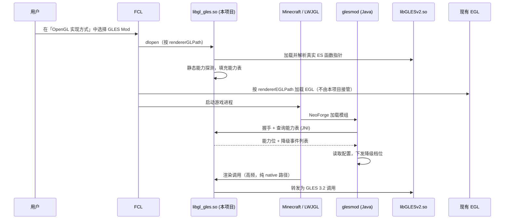

# GLES Mod 架构设计

> 状态：**草案待评审**
> 版本：v0.1（2026-09-25）
> 基线：Minecraft 1.21.1 + NeoForge 21.1.x + Java 21
> 许可证：LGPL-3.0-or-later

本文档是 P1-01 / P1-02 的设计依据。**评审通过前不应进入编码阶段**，因为其中 O-01（库替换可行性）与 O-06（着色器转换复用方式）尚未验证，二者都会实质性改变实现路径。

---

## 1. 目标与非目标

### 1.1 目标

让 Minecraft Java 版在 Android 上通过**原生 OpenGL ES 3.2**渲染，绕过 GL4ES / ANGLE 的高频翻译开销，同时保证原版 + JEI 可稳定运行，并与 Sodium / Embeddium 软依赖共存。

### 1.2 非目标

| 非目标 | 原因 |
|---|---|
| 不实现 Vulkan 后端 | 工程量与收益不成比例 |
| 不完整支持光影 / 计算着色器 | ES 3.2 能力边界决定 |
| 不自行创建 EGL 窗口与上下文 | 必须复用启动器已建立的上下文 |
| 不重写完整 GLSL → GLSL ES 转换器 | 见 §6，优先复用 |
| MVP 不实现 FCL 渲染器插件 | 先保证模组形态可用，插件为阶段三可选增强 |
| 不承诺初期性能超越 GL4ES | 定位是「可运行 + 可演进」，用数据说话 |

---

## 2. 关键前提：为什么是 native 而不是 Mixin

### 2.1 被否决的方案

任务书 v1 提出的方案是：Mixin 拦截 `org.lwjgl.opengl.GL11/GL20/GL30/GL31/GL32` → 转发到 `GlesBackend` → JNI 调用 `libGLESv2.so`。

**否决理由**：该方案在热点路径上引入了两层开销。

```
每一帧的调用量级（原版近似）：
  glDrawElements / glDrawArrays        ~10^2 – 10^3
  glUniform* / glBindTexture / glVertexAttribPointer   ~10^4 – 10^5
  glGetError / glIsEnabled 等查询类     ~10^3
```

其中每一条都要经过：Java 方法调用 → Mixin 字节码跳转 → Java 接口分发 → JNI 边界（栈帧转换 + 参数封送 + 局部引用管理）→ native。JNI 单次调用开销在 ARM 上通常是几十到几百纳秒，乘以 10^5 量级就是**每帧数十毫秒**，这已经超过 60 FPS 的预算。

GL4ES / NG-GL4ES 之所以有效，是因为它们在 native 层直接提供 `libGL.so` 的符号实现，Java 侧的 `glDrawElements` 经过 LWJGL 的 JNI 之后**直接落到 native 函数**，没有额外的 Java→native 往返。要与之竞争，本项目必须走同一层次的路线。

### 2.2 采纳的方案

**native 侧提供一个符号兼容的 `libGL.so` 替代实现。**

```
Minecraft (Java)
  └─ LWJGL  ──JNI──►  libGL.so  ← 【本项目提供，导出完整 GL 符号集】
                          │
                          ├─► 能力查询 / 路由判断（native 内，无 JNI）
                          ├─► libGLESv2.so（GPU 驱动，ES 3.2）
                          └─► [可选] GL4ES 回退符号
```

**为什么不需要 LD_PRELOAD 或 inline hook**：LWJGL 在 Linux/Android 平台通过 `dlopen`/`dlsym` 加载 `<GL>`（即 `libGL.so`）。启动器在构造启动参数时决定加载哪个库。只要本项目产出的 `.so` 被放在该位置，符号解析自然指向本项目实现。**这是一种「正当替换」而非「劫持」**，可维护性与稳定性都远优于 hook。

> ✅ **O-01 已闭环（2026-09-25）**：已核实 FCL 源码，其渲染器机制**本质就是 `dlopen` 一个 GL 库**，无需任何 hack：
>
> ```java
> // FCL/src/main/java/com/tungsten/fclauncher/FCLauncher.java
> bridge.dlopen(RendererPlugin.getSelected().getPath() + "/" + RendererPlugin.getSelected().getEglName());
> // 内置渲染器分支：
> bridge.dlopen(nativeDir + "/" + config.getRenderer().getGlName());
> ```
>
> FCL 还通过环境变量向该库传递渲染上下文信息（`POJAVEXEC_EGL`、`LIBGL_ES`）。
>
> **结论：本项目不需要改写启动器、不需要 LD_PRELOAD、不需要 inline hook。** 本项目的 native 实现本身就是 FCL 的一个合法渲染器插件。

### 2.3 关于「无法关闭渲染器」的技术澄清

FCL 设置中的「OpenGL 实现方式」**不是一个可以关闭的装饰层，而是进程级 GL 库的绑定点**：

- 游戏进程启动前，FCL 必须先 `dlopen` 一个库来提供 `libGL.so` 符号集
- 没有它，LWJGL 连 `glDrawElements` 的函数地址都无法解析，游戏无法启动
- 因此「完全关闭渲染器」在技术上等价于「不提供任何 GL 实现」——不成立

**正确的理解方式**：不是「关掉渲染器让 mod 接管」，而是**让本项目的实现本身成为那个渲染器**。装上插件后，FCL 设置项里会多出一个选项，用户选中即可。

| 诉求 | 实现方式 |
|---|---|
| 不想用 GL4ES / ANGLE | 在 FCL 中选择本项目的渲染器 |
| 想要比 GL4ES 更好的性能 | 插件路径：native 直通，无 Mixin/JNI 开销 |
| 想保留回退能力 | 配置开关 + FCL 随时可切回 GL4ES |

### 2.4 退回方案（已基本不必要）

O-01 闭环后，以下方案**仅在 FCL 以外的不支持插件化的启动器上才需要考虑**（如 Pojav 主仓库的硬编码 `Renderer.ID_*` 枚举）：

| 方案 | 做法 | 代价 |
|---|---|---|
| B1：LD_PRELOAD | 通过启动器自定义进程参数注入 | Android 上对已启动进程无效，需在进程启动前设置 |
| B2：Mixin 替换 LWJGL 函数指针 | 用 Mixin 改写 LWJGL 的 native 函数表绑定 | 回到 Java→JNI 开销问题 |
| B3：仅做兼容层 | 不做渲染替换，只做能力探测 + 降级路由 + Sodium 联动 | 性能无提升，但工程风险最低 |

**策略**：不再为 B1/B2 预留设计。若阶段四调研发现 Pojav 分支确需支持，再评估 B2（功能完整但性能妥协）。B3 的部分（Java 侧能力层）本身就是本项目的组成部分，已在阶段二实施。

### 2.5 FCL 的 EGL 与上下文创建机制（已核实）

> ✅ **O-08 已闭环（2026-09-25）**：已阅读 FCL 源码确认实现，**不存在与 ANGLE 叠加的双重翻译风险**。

#### EGL 库的选择逻辑

`FCL/src/main/jni/ctxbridges/egl_loader.c` 的 `dlsym_EGL()`：

```c
bool dlsym_EGL() {
    char* gles = getenv("LIBGL_GLES");
    char* eglName = (strncmp(gles ? gles : "", "libGLESv2_angle.so", 18) == 0)
                    ? "libEGL_angle.so"          /* 仅当显式指定 ANGLE 时 */
                    : getenv("POJAVEXEC_EGL");   /* 否则由渲染器决定 */
    void* dl_handle = loader_dlopen(eglName, "libEGL.so", RTLD_LOCAL|RTLD_LAZY);
    /*                                          ^^^^^^^^^^^ 兜底 */
    eglGetProcAddress_p = dlsym(dl_handle, "eglGetProcAddress");
    /* 其余 EGL 入口点全部经 eglGetProcAddress 动态解析 */
}
```

**三点关键事实**：

1. EGL 库由 `POJAVEXEC_EGL` 环境变量决定，兜底为 `libEGL.so`
2. ANGLE 仅在 `LIBGL_GLES == "libGLESv2_angle.so"` 时启用
3. **ANGLE 不是任何内置渲染器的默认配置**

#### 内置渲染器的 EGL 配置

来自 `FCL/src/main/java/com/mio/manager/RendererManager.kt`：

| 渲染器 | GL 库 | EGL 库 |
|---|---|---|
| Holy-GL4ES | `libgl4es_114.so` | `libEGL.so` |
| Krypton Wrapper (NG-GL4ES) | `libng_gl4es.so` | `libEGL.so` |
| VirGL | `libOSMesa_81.so` | `libEGL.so` |
| VGPU | `libvgpu.so` | `libEGL.so` |
| Freedreno | `libOSMesa_8.so` | `libEGL.so` |
| Zink | `libglxshim.so` | `libEGL_mesa.so` |

**6 个内置渲染器中，5 个使用系统 `libEGL.so`，Zink 使用 `libEGL_mesa.so`；无一个使用 ANGLE。** 二者均为厂商/系统 EGL 实现（直接对接 GLES 驱动），非翻译层。

#### 上下文创建

`FCL/src/main/jni/ctxbridges/gl_bridge.c` 的 `gl_init_context()`：

```c
/* API 绑定：非 desktopgl 模式一律绑 ES */
if (strncmp(getenv("POJAV_RENDERER"), "opengles3_desktopgl", 19) == 0) {
    bindResult = eglBindAPI_p(EGL_OPENGL_API);
} else {
    bindResult = eglBindAPI_p(EGL_OPENGL_ES_API);
}

/* 上下文版本来自 LIBGL_ES */
int libgl_es = strtol(getenv("LIBGL_ES"), NULL, 0);
if (libgl_es < 0 || libgl_es > INT16_MAX) libgl_es = 2;
const EGLint egl_context_attributes[] = {EGL_CONTEXT_CLIENT_VERSION, libgl_es, EGL_NONE};
bundle->context = eglCreateContext_p(g_EglDisplay, bundle->config, /*...*/, egl_context_attributes);
```

#### 结论：链路无重复翻译

```
我们的 libgl_gles.so（桌面 GL → ES 3.x 映射）
    ↓ 输出原生 ES 调用
系统 libEGL.so + 厂商 GLES 驱动（原生执行）
```

系统 `libEGL.so` 是厂商 EGL，**直接对接设备 GLES 驱动，不是翻译层**。因此「不接管 EGL」的决策成立。

#### ⚠️ 必须处理的隐患：插件渲染器不自动设置 `LIBGL_ES`

`FCLauncher.addRendererEnvInner()` 对**插件渲染器**只设置 `POJAVEXEC_EGL`、`POJAV_RENDERER` 与插件声明的 env，然后直接 `return`——**不会设置 `LIBGL_ES`**（内置渲染器才会）。

若 `LIBGL_ES` 未设置，`strtol(getenv("LIBGL_ES"), NULL, 0)` 的参数为 NULL，行为不可靠，上下文版本也不可控。

**要求（P1-05）**：必须在插件 APK 的 env 中显式声明 `LIBGL_ES=3`（作为 `NormalEnv`，用户不可改）。

#### GL 库如何被 LWJGL 获取

```java
// FCLauncher.setupGraphicAndSoundEngine()
long handle = bridge.dlopen(config.getRenderer().getGLPath());   // ① 预加载
if (Build.VERSION.SDK_INT < Build.VERSION_CODES.R) {
    Os.setenv("RENDERER_HANDLE", handle + "", true);             // ② Android 11 以下
}
```

```c
/* lwjgl_dlopen_hook.c —— ndlopen 被 hook */
if (getenv("RENDERER_HANDLE") != NULL && strstr(filename,"plugin")) {
    return (jlong) strtol(getenv("RENDERER_HANDLE"), NULL, 10);
}
```

插件 APK 的库路径含 `plugin`（包名 `com.mio.plugin.renderer.xxx`），因此 LWJGL 请求加载时直接拿到已加载句柄。另外启动参数模板中的 `${gl_lib_name}` 会被替换为 `getGLPath()`。

**推论**：本项目的库**必须导出完整 GL 符号集**，因为 LWJGL 会对该句柄做 `dlsym`。与 §5.1 的设计一致。

#### 附带发现：MobileGlues 采用不同集成模式

```c
/* sdl_hook.c */
const char *egl = getenv("POJAVEXEC_EGL");
if (egl && strcmp(egl, "libmobileglues.so") == 0) { ... }
```

MobileGlues 被当作 **EGL 库**加载，即它**同时提供 EGL 与 GL**。这是可选的另一种集成模式。若未来发现系统 EGL 在某些设备上有问题（如无法创建 ES 3.2 上下文），可参考此模式接管 EGL。当前设计不需要。

---

## 3. 模块划分

采用「一份 native 核心 + 两层薄包装」的单仓多产物结构。

```
glesmod-template-1.21.1/
├── src/main/java/com/youyimc/glesmod/     # NeoForge mod 形态（Java）
│   ├── GLESMod.java              # 模组入口（common）
│   ├── GLESModClient.java        # 客户端入口
│   ├── config/                   # 配置系统
│   ├── capability/               # 能力探测与上报（GlesCapabilityProvider 实现）
│   ├── compat/                   # Sodium / Embeddium 软依赖联动
│   ├── degrade/                  # 降级事件收集与日志
│   └── backend/                  # native 绑定（JNI 声明 + 加载器）
│
├── native/                       # 【核心】C/C++ 源码
│   ├── CMakeLists.txt
│   ├── include/
│   │   └── gles_backend.h        # 对外 ABI
│   ├── src/
│   │   ├── entry_gl11.c          # GL 1.x 符号导出
│   │   ├── entry_gl20.c          # GL 2.x 符号导出
│   │   ├── entry_gl30.c          # GL 3.x 符号导出
│   │   ├── caps.c                # 能力查询
│   │   ├── state.c               # 状态缓存（阶段三）
│   │   ├── shader_conv.c         # 着色器转换接入（见 §6）
│   │   └── log.c                 # 降级事件记录
│   └── tools/
│       └── check_symbols.sh      # 符号覆盖率检测（见 §5.3）
│
├── fcl-plugin/                   # 【阶段一并行】FCL 渲染器插件壳
│   ├── build.gradle.kts          # Android 应用模块
│   ├── src/main/AndroidManifest.xml
│   │     # meta-data: fclPlugin_V2 = @string/config
│   └── src/main/res/values/strings.xml
│         # <string name="config"> JSON 形式的 RendererConfigV2
│
└── docs/
    ├── architecture.md           # 本文档
    └── capability-interface.md   # 能力接口契约
```

### 3.1 插件壳的配置内容

`fcl-plugin/src/main/res/values/strings.xml` 中的 `config` 资源（JSON）：

```json
{
  "displayName": "GLES Mod",
  "rendererId": "glesmod",
  "rendererGLPath": "libgl_gles.so",
  "rendererEGLPath": "libEGL.so",
  "dlopenLibPaths": ["libgl_gles_core.so"],
  "env": [
    { "type": "NormalEnv", "key": "LIBGL_ES", "value": "3" },
    { "type": "NormalEnv", "key": "GLESMOD_ABI", "value": "1" },
    { "type": "SelectableEnv", "key": "GLESMOD_DEGRADE_LEVEL",
      "title": { "key": "glesmod_env_degrade_level" },
      "items": { "defaultValue": "1", "values": ["0", "1", "2"] } },
    { "type": "ToggleableEnv", "key": "GLESMOD_STATE_CACHE", "value": "1",
      "title": { "key": "glesmod_env_state_cache" }, "toggle": true }
  ],
  "minMCVer": "1.21.1",
  "maxMCVer": "1.21.1"
}
```

> ⚠️ **`LIBGL_ES=3` 是必需的**（O-09）：FCL 不会为插件渲染器自动设置该变量，而它决定 EGL 上下文版本（见 §2.5）。遗漏会导致上下文版本不可控。
>
> `rendererEGLPath` 填 `libEGL.so`（复用系统 EGL）。**本项目不接管 EGL**。

**分层原则**：Java 层与 native 层之间**只有一个窄接口**（能力查询 + 事件上报 + 版本握手），不传递渲染调用。mod 形态与插件形态**共用同一份 native 核心**，差异仅在加载方式与配置界面。

---

## 4. Java 层职责

Java 层**不参与高频渲染路径**，只做四件事：

| 职责 | 说明 | 对应任务 |
|---|---|---|
| 能力探测 | 启动时调用 JNI 查询能力表，缓存结果，暴露为标准接口 | P1-02 / P2-01 |
| 配置系统 | 读用户配置，决定降级档位与回退开关，下发给 native | P2-01 |
| 兼容层联动 | 检测 Sodium / Embeddium 版本，调整其内部功能标志 | P2-02 / P2-03 |
| 日志与上报 | 收集 native 上报的降级事件，输出玩家可读日志与统计数据 | P1-02 / P2-04 |

### 4.1 启动时序



**关键点**：
- native 层在 `dlopen` 时即完成静态能力探测（此时 EGL 上下文尚未创建），在首次 `eglMakeCurrent` 后完成动态能力查询。Java 层查询的是已缓存结果，不做阻塞式 GL 调用。
- **插件模式下 EGL 由 FCL 按 `rendererEGLPath` 自行加载**，本项目不介入。

> ✅ **O-08 已闭环**：FCL 使用的是系统 `libEGL.so`（厂商 EGL，直接对接 GLES 驱动），**非 ANGLE，无双重翻译风险**。详见 §2.5。
>
> ⚠️ **但需注意**：插件渲染器不会自动设置 `LIBGL_ES`，必须在插件 env 中显式声明 `LIBGL_ES=3`（见 §2.5）。

> ⚠️ 时序风险：NeoForge 加载模组的时机与 EGL 上下文创建时机在不同启动器上可能不同。若 Java 层查询能力时上下文未就绪，应返回「未就绪」状态而非阻塞。此行为需在实现前确认。

---

## 5. native 层职责

### 5.1 符号导出范围

必须覆盖 Minecraft 1.21.1 实际使用的 GL 符号。范围按优先级分三档：

| 档位 | 内容 | MVP 要求 |
|---|---|---|
| 必需 | GL 1.1 固定功能 + GL 2.0 着色器 + EGL 核心 | ✅ 必须 |
| 重要 | GL 3.0/3.2（VAO、FBO、instancing、`glMultiDraw*`） | ✅ 必须（Sodium 依赖） |
| 扩展 | ARB / EXT 扩展入口（如 `glFenceSync`、`glMapBufferRange`） | ⚠️ 部分，未覆盖者回退 |

**符号清单必须由工具生成而非手写**，避免遗漏。生成方式：扫描 LWJGL 的 native 绑定 + 实际运行时的 `dlsym` 调用记录（见 §5.3）。

### 5.2 能力表

native 层维护一个全局能力表，初始化后只读：

```c
typedef struct {
    /* 版本 */
    int  es_major, es_minor;
    int  gl_major, gl_minor;      /* 映射后对外声称的桌面 GL 版本 */

    /* 功能支持位 */
    bool multi_draw;              /* GL_EXT_multi_draw_arrays 或 ES 3.2 原生 */
    bool compute_shaders;         /* ES 3.1+ 且驱动实际支持 */
    bool persistent_mapping;      /* GL_EXT_buffer_storage / ES 3.2 */
    bool instancing;              /* ES 3.0 原生，恒为 true，保留供降级开关 */
    bool draw_buffers_multiple;   /* ES 3.0+ */
    bool texture_storage;         /* glTexStorage2D */
    bool anisotropy;              /* EXT_texture_filter_anisotropic */
    bool debug_output;            /* KHR_debug */

    /* 容量 */
    int  max_texture_units;
    int  max_draw_buffers;
    int  max_texture_size;
    int  max_samples;

    /* 降级档位（由 Java 层下发） */
    int  degrade_level;           /* 0=保守 1=默认 2=激进 */
} gles_caps_t;
```

**设计约束**：能力表是**只读快照**，运行时不变。任何需要在运行时改变的策略（如临时禁用某功能）通过 `degrade_level` 与单独的降级标志位实现，避免能力表被并发修改。

### 5.3 符号覆盖率检测

防回归的关键工具。做法：

1. 从 LWJGL 的 `liblwjgl.so` 导出表中提取所有 `gl*` / `egl*` 符号 → `expected.txt`
2. 从本项目 `.so` 导出表中提取 → `provided.txt`
3. 求差集，输出未覆盖符号清单与覆盖率百分比
4. 对未覆盖符号，检查 GL4ES 是否提供；提供则可安全回退，否则标记为**阻塞风险**

```bash
# native/tools/check_symbols.sh 的预期用法
./check_symbols.sh build/liblwjgl.so build/libgl_gles.so
# => 覆盖率: 812/834 (97.4%)
# => 未覆盖: glGetnUniformfv, glMultiDrawElementsBaseVertex, ...
```

此脚本的产出直接对应验收标准第 8 条。

---

## 6. 着色器转换决策（O-06）

这是最需要提前定性的技术点。

### 6.1 问题规模

桌面 GLSL → GLSL ES 320 的差异不是简单的版本号替换：

| 差异类别 | 例子 | 转换难度 |
|---|---|---|
| 版本声明 | `#version 150` → `#version 320 es` | 低（字符串替换） |
| 精度限定符 | ES 要求 `precision mediump float;` 或逐变量限定 | 低（插入声明） |
| 隐式类型转换 | 桌面允许 `int`→`float` 隐式，ES 严格 | 中（需类型推导） |
| 内置变量 | `gl_FragColor` 在 core profile 已移除 | 中 |
| 废弃内置 | `texture2D()` → `texture()` | 低 |
| 扩展依赖 | `GL_ARB_shader_image_load_store` 无 ES 对应 | 高（需改写算法或降级） |
| 几何/细分着色器 | ES 3.2 无几何着色器 | 极高（无法转换） |

### 6.2 三个选项

| 选项 | 做法 | 优点 | 缺点 |
|---|---|---|---|
| A. 链接 GL4ES 的转换器 | 复用其 glsl 转换模块 | 成熟、覆盖广 | GL4ES 为 MIT，可合法复用，但需处理接口耦合；且其转换器与自身上下文管理强耦合 |
| B. 复用 Minecraft / Sodium 的着色器源码 | MC 1.21.1 的着色器已是 GLSL core 且已知集合，可预置转换后的 ES 版本 | 覆盖 100%、零运行时开销 | 仅覆盖原版 + Sodium，其他模组的自定义着色器仍会失败 |
| C. 自研完整转换器 | 从零实现 | 完全可控 | 工作量巨大，等同于重做一个 GLSL 前端 |

### 6.3 决策：尽最大努力兼容（已定）

**已确认策略：尽最大努力兼容，无法兼容则降级，绝不崩溃。**

采用 **预置转换 + 转换器兜底** 的组合，不做完整自研 GLSL 前端：

| 层次 | 做法 | 覆盖范围 |
|---|---|---|
| **第一层：预置转换** | 针对 MC 1.21.1 与 Sodium 0.8.13 的已知着色器集合，预置转换结果或转换规则 | 原版 + Sodium（100%） |
| **第二层：运行时转换器** | 对第三方模组注入的自定义着色器，调用 GL4ES 的转换逻辑处理 | 尽力覆盖 |
| **兜底：降级** | 无法转换时返回编译失败，记录降级事件，交回模组自行处理 | 不崩溃 |

**降级路径的具体行为**：

```
第三方着色器进入 glShaderSource
  └─ 尝试转换
       ├─ 成功 → 正常编译
       ├─ 部分成功（有警告）→ 编译 + 记录 DEGRADE 事件
       └─ 失败 → 返回编译错误码 + 记录 SHADER_CONVERSION_FAILED
              └─ 模组自行处理（多数会捕获编译失败并回退到备用着色器）
              └─ 若模组未处理 → 该渲染特性失效，游戏仍可运行
```

**不做的事**：

| 不做 | 原因 |
|---|---|
| 不静默丢弃着色器 | 会导致渲染结果错误且难以诊断 |
| 不抛异常中止游戏 | 违背「任何后端故障不导致崩溃」原则 |
| 不尝试模拟 ES 不存在的硬件特性（几何/细分着色器） | 无法用软件层可靠实现 |

> 仍需注意：**几何着色器与细分着色器在 ES 3.2 上不存在**，使用它们的模组无法通过转换解决。这类情况会明确记录降级事件，属于策略允许的失败范围。

---

## 7. 兼容层设计（Sodium / Embeddium）

### 7.1 版本基线

| 模组 | 目标版本 | 说明 |
|---|---|---|
| Sodium | `0.8.13-neoforge` for MC 1.21.1 | 已核实存在该产物 |
| Embeddium | 待定 | NeoForge 侧对应物，需核实 1.21.1 可用版本 |

> 注意：Sodium 自 0.6 起采用 Polyform Shield 许可证，**不可复制其代码**。本项目只做运行时软依赖检测与行为调整，不链接、不分发其代码。

### 7.2 联动方式

```
glesmod 启动
  └─ 检测 Sodium 是否存在（ModList）
       ├─ 否 → 原版路径，使用默认降级档位
       └─ 是 → 读取版本号
              ├─ 命中已知版本（0.8.13）→ 应用该版本专用兼容策略
              ├─ 版本更高/未知 → 使用保守策略 + 警告日志，不强行注入
              └─ 版本更低 → 拒绝联动，提示用户升级
```

**核心原则：宁可保守，不可激进。** 未知版本一律走保守路径并明确告知用户，避免因猜测内部实现而导致崩溃。

### 7.3 Sodium 依赖的 ES 不支持功能

| Sodium 功能 | ES 3.2 状态 | 处理 |
|---|---|---|
| `glMultiDrawElementsBaseVertex` | 无原生对应 | 降级为循环 `glDrawElementsBaseVertex` |
| 持久映射（`glMapBufferRange` + `GL_MAP_PERSISTENT_BIT`） | ES 3.2 支持，但驱动实现质量参差 | 探测后用，失败回退 `glBufferSubData` |
| `glFenceSync` / `glClientWaitSync` | ES 3.0 支持 | 直接用 |
| 间接绘制（`glDrawElementsIndirect`） | ES 3.1 支持 | 探测后用 |
| 计算着色器 | ES 3.1 支持 | 原版不用；Sodium 0.8 部分功能用，需探测 |

> O-04：Sodium 0.8.x 使用 ThinGL 作为 GL 抽象层，其实际调用的 GL 符号集合需核实后才能确定降级点。**这是进入阶段二前必须完成的前置工作。**

---

## 8. 风险登记

| 编号 | 风险 | 概率 | 影响 | 应对 |
|---|---|---|---|---|
| ~~R-01~~ | ~~GL 库替换在目标启动器上不可行~~ | — | — | ✅ 已闭环：FCL 渲染器即 `dlopen` GL 库 |
| R-02 | GL 符号覆盖不全导致启动失败 | 高 | 高 | 符号检测脚本 + 未覆盖项回退 GL4ES |
| R-03 | 着色器转换失败导致部分模组特性不可用 | 高 | 中 | 两层转换；失败不崩溃；几何/细分着色器属已知不可行范围 |
| R-04 | 驱动差异导致渲染错误 | 高 | 中 | 设备兼容性数据库 + 全局回退开关 |
| R-05 | Sodium 版本更新导致兼容层失效 | 高 | 中 | 版本白名单 + 保守策略 |
| R-06 | 性能不如 GL4ES | 中 | 中 | 定位「可运行」；用数据说话；保留回退 |
| R-07 | 无法本地验证，反馈周期长 | 高 | 高 | 标准化测试清单 + 日志采集脚本，降低用户反馈成本 |
| R-08 | 许可证污染（参考了 GPL 代码） | 中 | 高 | 只参考思路不复制代码；记录借鉴来源 |
| ~~R-09~~ | ~~FCL 的 EGL 实为 ANGLE，造成双重翻译~~ | — | — | ✅ 已排除：FCL 使用系统 `libEGL.so`，非 ANGLE |
| **R-10** | **插件渲染器未设置 `LIBGL_ES`，上下文版本不可控** | 高 | 高 | 插件 env 中显式声明 `LIBGL_ES=3`（P1-05） |
| **R-11** | 设备驱动不支持创建 ES 3.2 上下文，仅能到 3.0/3.1 | 中 | 中 | 运行时探测实际版本，按能力表降级；任务书本就允许回退 ES 3.0 |

---

## 9. 待确认事项

以下事项阻塞编码，详见任务书 §12：

| 编号 | 事项 | 阻塞的任务 | 状态 |
|---|---|---|---|
| ~~O-01~~ | ~~`libGL.so` 替换在 FCL / Pojav 分支的可行性~~ | — | ✅ 已闭环 |
| ~~O-06~~ | ~~着色器转换复用方式~~ | — | ✅ 已定：预置 + 兜底 + 降级 |
| O-02 | GL 符号导出清单完整度 | P1-04 | 待整理 |
| O-03 | MobileGlues / NG-GL4ES 许可证兼容性比对 | 全局 | 待评估 |
| O-04 | Sodium 0.8.13 的 ThinGL 依赖与符号集合 | P2-03 | 待核实 |
| O-05 | 目标真机与编译器版本 | 测试 | 待确认 |
| O-07 | GitHub 仓库发布策略 | CI | 待确认 |
| ~~O-08~~ | ~~FCL 当前 EGL 实现是否为 ANGLE~~ | — | ✅ 已闭环：使用系统 `libEGL.so`，非 ANGLE |

---

## 10. 下一步

1. **整理 O-02**：生成 GL 符号清单，评估 MVP 工作量。
2. **完成 O-03**：确认自研实现的许可证边界。
3. 进入 P1-01 工程基线改造（清理模板示例代码、配置 LGPL-3.0-or-later）。
